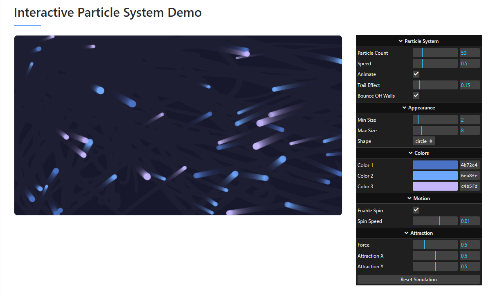
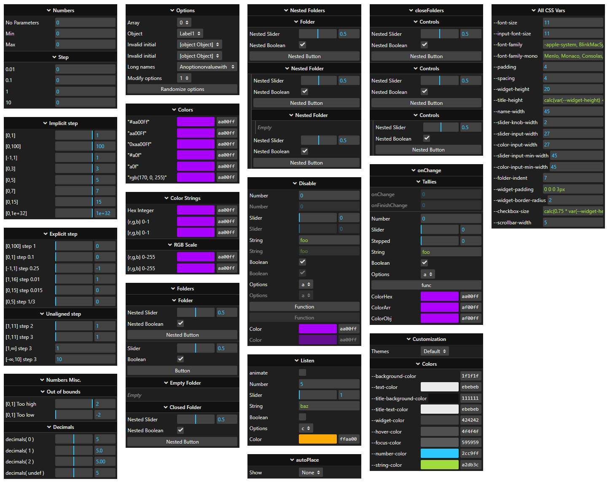

# RAD-GUI 🎮

<div align="center">
  
  
  
  <a href="https://github.com/ineffably/rad-gui/actions/workflows/build.yml">
    
  </a>
  
</div>

<p align="center">
  <b>Lightweight, flexible GUI controls for your JavaScript applications</b><br>
  <sub>Create beautiful control panels with minimal code</sub>
</p>

<div align="center">
  <a href="https://ineffably.github.io/rad-gui/">See an interactive example here!</a>
  <span>&nbsp;|&nbsp;</span>
  <a href="CHANGELOG.md">View Changelog</a>
</div>

## ✨ Features

- **Lightweight & Fast**: Designed for performance with minimal dependencies
- **Modern API**: Clean, chainable interface for building controls
- **Responsive**: Works across desktop and mobile devices
- **Highly Customizable**: Easily themed with CSS variables
- **Compatible**: Inspired by and compatible with lil-gui and dat-gui as a drop-in replacement
- **Fully Typed**: Written in TypeScript with complete type definitions
- **AI-Ready**: Includes LLM-optimized codebase reference for AI assistants and agents

## 📦 Installation

```bash
# Using npm
npm install rad-gui

# Using yarn
yarn add rad-gui
```

## 🚀 Quick Start

### JavaScript
```javascript
import { GUI } from 'rad-gui';
import 'rad-gui/lib/rad-gui.css';

// Create a GUI instance
const gui = new GUI();
const params = { x: 0, y: 0, color: '#ff0000' };

gui.add(params, 'x', 0, 100);
gui.addColor(params, 'color');
```

### TypeScript  
```typescript
import { GUI, ControlEventData } from 'rad-gui';
import 'rad-gui/lib/rad-gui.css';

interface DemoParams {
  x: number;
  y: number;
  color: string;
  enabled: boolean;
}

const gui = new GUI({ title: 'Controls', width: 300 });
const params: DemoParams = { x: 0, y: 0, color: '#ff0000', enabled: true };

// Full type safety and IntelliSense support
gui.add(params, 'x', 0, 100)
  .onChange((data: ControlEventData<number>) => {
    console.log(`X changed to ${data.value}`);
  });

gui.addColor(params, 'color');
gui.add(params, 'enabled');
```

For a complete example, see our [TypeScript Example](examples/ts-sample/) which demonstrates all features with proper typing.

## 📚 Documentation

RAD-GUI provides comprehensive type definitions and IntelliSense support for TypeScript projects. The library includes:

- Complete type definitions for all controls and options
- Proper event callback typing with structured data
- Generic overloads for type-safe parameter handling  
- Interface definitions for configuration objects

## 📋 API Reference

### Creating a GUI

```typescript
// Basic GUI creation
const gui = new GUI();

// With options
const gui = new GUI({
  title: 'My Controls',
  width: 300,
  autoPlace: false,
  closeFolders: true
});
```

### Adding Controls

```typescript
// Auto-detected control types
gui.add(object, 'numberProperty');     // → NumberControl
gui.add(object, 'booleanProperty');    // → ToggleControl  
gui.add(object, 'stringProperty');     // → TextControl
gui.add(object, 'functionProperty');   // → FunctionControl

// Explicit control types
gui.add(object, 'number', 0, 100, 1);           // NumberControl with range
gui.add(object, 'option', ['A', 'B', 'C']);     // OptionControl
gui.addColor(object, 'color');                  // ColorControl
```

### Event Handling

```typescript
// Individual control events
gui.add(params, 'value')
  .onChange((data: ControlEventData) => {
    console.log(`${data.property} changed to ${data.value}`);
  })
  .onFinishChange((data: ControlEventData) => {
    console.log('Finished changing:', data);
  });

// Global GUI events  
gui.onChange((data: ControlEventData) => {
  // Called for any control change
});

gui.onOpenClose((gui: GUI) => {
  // Called when folders open/close
});
  doSomething() { 
    console.log('Button clicked!');
  }
};

// Add controls
gui.addColor(params, 'color').name('Color');
gui.add(params, 'x', 0, 100).name('X Position');
gui.add(params, 'y', 0, 100).name('Y Position');
gui.add(params, 'enabled').name('Enabled');
gui.add(params, 'option', ['A', 'B', 'C']).name('Option');
gui.add(params, 'doSomething').name('Run Action');

// Create a folder for grouped controls
const folder = gui.addFolder('Advanced Settings');
folder.add(params, 'x').step(5).name('X (Step 5)');
```

## Previews

<a href="https://ineffably.github.io/rad-gui/">
  
</a>
<a href="https://ineffably.github.io/rad-gui/examples/kitchen-sink/index.html">
  
</a>

## 📚 Documentation

<div align="center">
  <h3><a href="usage.md">📖 Complete Usage Guide</a></h3>
  <p>Step-by-step tutorials, best practices, and advanced usage examples</p>
</div>

For API details and reference information, visit the [API Reference](https://yourproject.github.io/rad-gui/).

## 🤖 For AI Assistants and Tools

This project includes a `.llm.reference.md` file specifically designed for AI assistants, agents, and tools to better understand and work with the codebase. This file contains:

- Comprehensive architecture overview
- Key component descriptions
- Usage patterns and code examples
- Core utility functions

AI tools can reference this file to provide more accurate and helpful suggestions when working with rad-gui.

## 📋 Available Controls

RAD-GUI supports various control types based on the parameter's value and provided options:

| Type | Description | Example |
|------|-------------|---------|
| **Number** | Slider or text input for numbers | `gui.add(params, 'x', 0, 100)` |
| **Boolean** | Checkbox for true/false values | `gui.add(params, 'visible')` |
| **String** | Text input field | `gui.add(params, 'name')` |
| **Function** | Button that calls a function | `gui.add(params, 'save')` |
| **Color** | Color picker | `gui.addColor(params, 'color')` |
| **Options** | Dropdown for selecting from options | `gui.add(params, 'size', ['S', 'M', 'L'])` |

## 🎨 Customization

RAD-GUI is easily styled using CSS variables:

```javascript
// Create and apply a custom theme
const darkTheme = {
  '--background-color': '#1a1a1a',
  '--text-color': '#e0e0e0',
  '--title-background-color': '#272727',
  '--title-text-color': '#ffffff',
  '--widget-color': '#2c2c2c',
  '--hover-color': '#3c3c3c',
  '--focus-color': '#444444',
  '--number-color': '#2cc9ff',
  '--string-color': '#a2db3c'
};

// Apply theme to a specific GUI instance
Object.entries(darkTheme).forEach(([key, value]) => {
  gui.domElement.style.setProperty(key, value);
});
```

## 📝 Examples

Explore more examples in the `examples` directory:

- **[TypeScript Example](examples/ts-sample/)** - Comprehensive TypeScript demonstration with all control types, event handling, and best practices
- [Basic Controls](examples/index.example.html) - Simple introduction to rad-gui
- [Kitchen Sink](examples/kitchen-sink/index.html) - Demonstrates all available controls
- [Compatibility Demo](examples/dat-gui-compat.html) - Shows compatibility with dat-gui

## 🧪 Development

```bash
# Install dependencies
npm install

# Build development version
npm run build:dev

# Run tests
npm run test

# View demo
npm run local:kitchen-sink
```